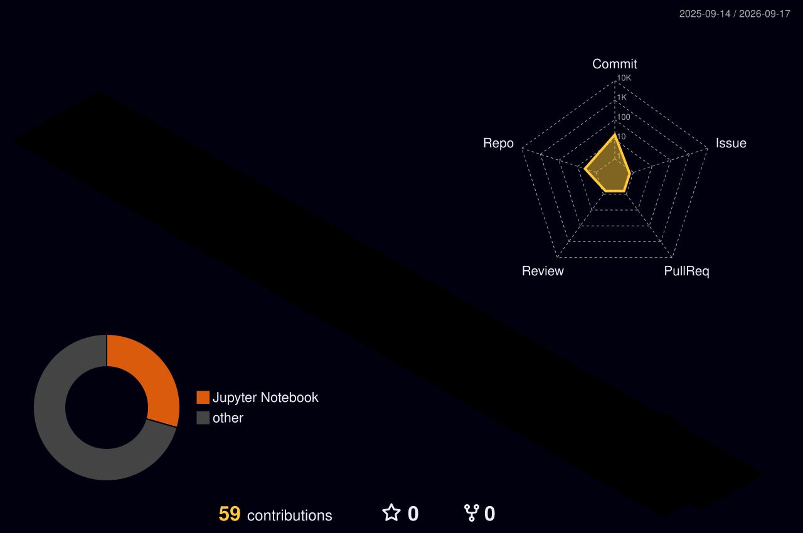

###  Nice ways to reach me

----

Hi! I am a Medical AI graduate student in an integrated Master’s and PhD program.

----

### Personal stats:

  
Highlights / Proficiencies

   

  <strong>Highlights</strong>  
  - ⭐
   

  <strong>Proficiencies</strong>  
  - 📚 Languages: Python, R  
  - 🧠 AI & Computer Vision: Python, OpenCV, basic reinforcement learning & media processing  
  - 🔧 Collaboration & Etc.: Git, GitHub, Notion

### 💪 Skills

----

